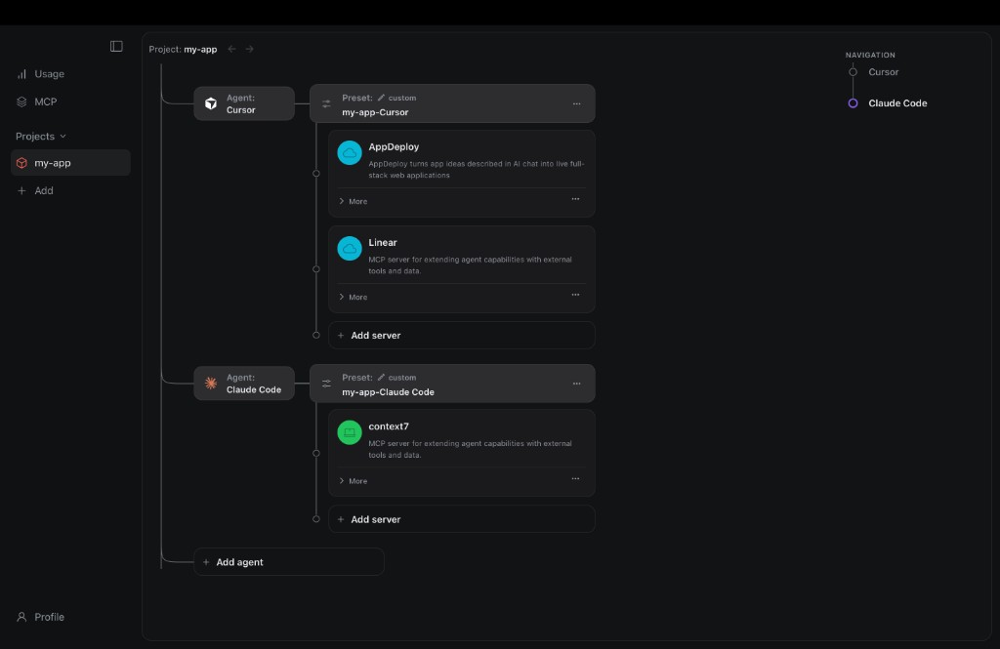
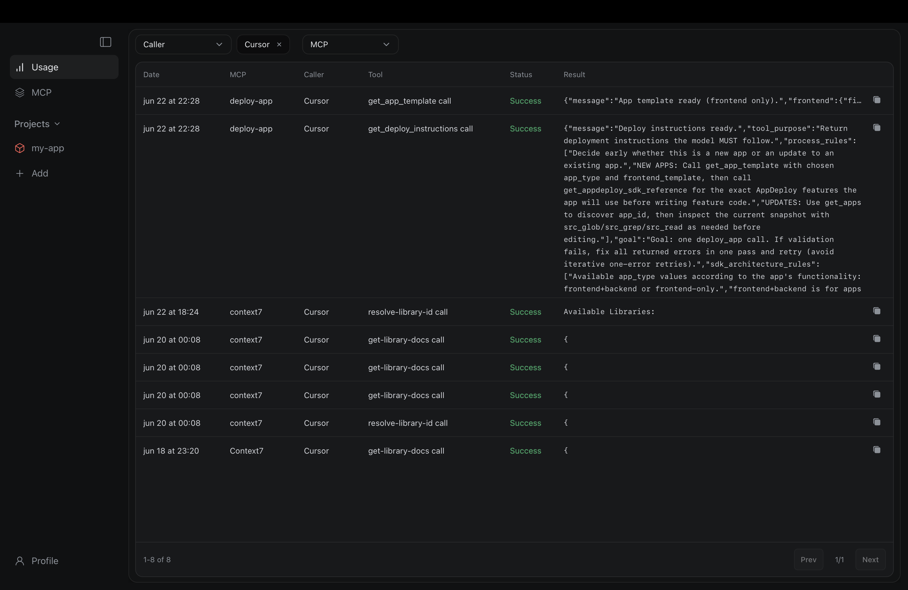
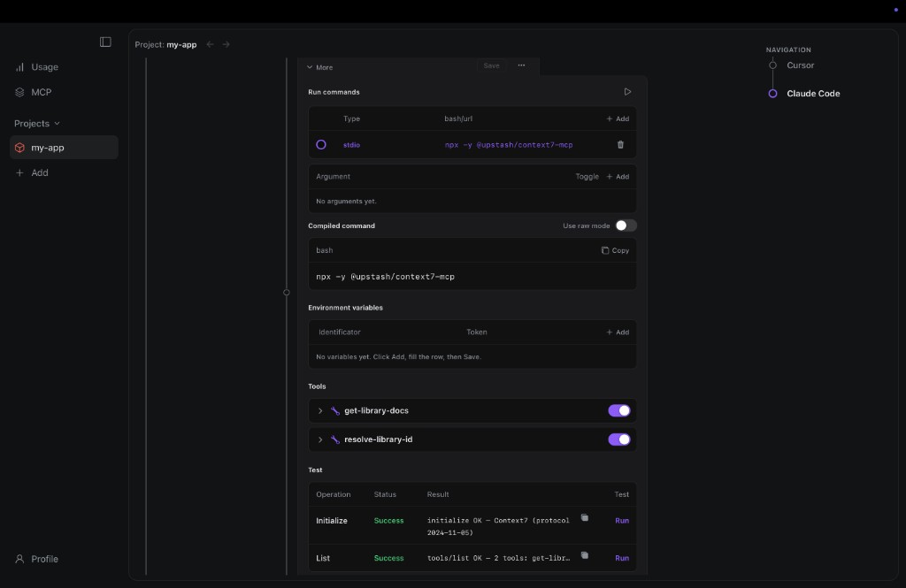
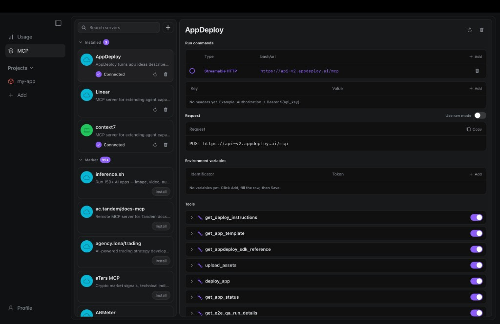

<p align="center">
  
</p>

<h1 align="center">TaseDeck - Topology of agent-server execution</h1>

<p align="center">
  A desktop control plane for MCP servers, project presets, agent configs, and tool-call observability.
</p>

<p align="center">
  <a href="#what-is-tasedeck">Overview</a> ·
  <a href="#ui">UI</a> ·
  <a href="#how-it-works">How it works</a> ·
  <a href="#tech-stack">Tech stack</a> ·
  <a href="#development">Development</a>
</p>

---

## What Is TaseDeck

TaseDeck is a desktop application for managing the execution topology between AI agents and MCP servers.

Instead of manually editing multiple `mcp.json` files, duplicating server definitions between projects, or losing track of which agent calls which tool, TaseDeck gives you one local UI for:

- discovering and installing MCP servers from the official registry;
- configuring local, remote, stdio, HTTP and OAuth-backed servers;
- connecting MCP servers to specific projects and specific agents;
- keeping each agent's default configuration safe;
- exporting project-local proxy entries into the correct agent config format;
- observing real tool calls in the Usage view.

The main idea is simple: **agents stay native, MCP servers stay configurable, and TaseDeck owns the topology between them.**

---

## UI

### Project Topology

The Projects screen shows how a project is wired: project -> agent -> preset -> MCP servers. Each agent can have its own server set, its own custom preset, and its own exported project config.



This view is designed around execution topology, not just lists. You can see which agents are attached to the project, what preset each agent is using, which MCP servers are active, and where servers can be added or removed.

### Usage Log

The Usage screen records MCP tool calls routed through the project proxy. It helps answer: which agent called which server, which tool was invoked, whether it succeeded, and what result came back.



The filters let you inspect calls by caller, MCP server, date, and result. This is useful for debugging agent behavior, validating project presets, and understanding which tools are actually used in a workflow.

### Server Runtime

Every MCP server has an editable runtime profile: command, arguments, environment variables, headers, active transport, tool list, and test results.



For local servers, TaseDeck stores the compiled command and can test initialization and tool listing from the UI. For remote servers, it supports HTTP transport and OAuth flows. Tool toggles let you expose only the tools you want.

### MCP Registry

The MCP screen combines installed servers and registry discovery. You can browse installed servers, search registry entries, install new servers, inspect their runtime configuration, and refresh tool metadata.



The installed list is intentionally compact; details live in the right panel. This keeps server discovery, installation, testing, and editing in a single workflow.

---

## Core Mechanics

### Agent discovery and config parsing

On first launch, TaseDeck scans known config locations for supported agents:

- Cursor
- Claude Code
- VS Code
- OpenCode
- Windsurf
- Codex CLI
- Antigravity
- GitHub Copilot

Each provider knows its native config directory and config file shape. TaseDeck reads the existing config, strips its own managed entries, and keeps the user's original MCP servers as the agent's default source.

This means the app can start from what already exists on disk. If an agent already has `mcp.json`, TaseDeck parses it and turns it into structured project/default data instead of forcing the user to recreate everything manually.

### Default config preservation

TaseDeck keeps a default snapshot of native MCP configuration. That default is treated as the baseline for the project/agent relationship.

The default config is important because it gives the user a safe way to experiment:

- import existing MCP servers from a project or agent config;
- create a custom preset for a specific agent;
- add, remove, or override servers inside TaseDeck;
- export the managed proxy entries;
- reset the agent back to the default source when needed.

TaseDeck-managed entries are identifiable and can be removed without destroying the user's own native config.

### Reset agent

Each project agent can be reset. Reset means:

- restore the agent/project `mcp.json` from the saved default source;
- remove the custom preset and custom cache for that agent;
- unlink the agent from the project assignment;
- remove TaseDeck-managed proxy entries while preserving the original config.

This is useful when a project setup becomes noisy, when the user wants to rebuild the topology, or when they want to return to the original agent state.

### Per-agent customization

Different agents can use different MCP servers in the same project.

For example:

- Cursor can use `AppDeploy` and `Linear`;
- Claude Code can use `context7`;
- another agent can use a minimal read-only preset;
- each agent can have different env values, arguments, headers, and enabled tools.

This is handled through project-agent assignments, presets, custom preset caches, and config overrides. The UI exposes this as a project tree where every agent branch can have its own preset and server list.

### Presets and overrides

Presets are server collections. A project can have a default imported preset, while each agent can fork it into a custom preset.

Overrides are stored per project-agent assignment and applied on top of preset server definitions. They can affect runtime details such as:

- command arguments;
- environment variables;
- headers;
- selected run command;
- enabled/disabled tools.

The goal is to avoid duplicating whole server definitions when only one project or one agent needs a small difference.

### MCP server installation

Registry installation supports both remote and local servers.

For registry entries, TaseDeck parses package metadata, transport hints, environment variables, command templates, and remote endpoints. Local npm packages are installed through shell commands such as `npm install -g ...`, while the runtime command can be generated as `npx -y ...` or `npm exec ...` depending on the package profile.

The production app enriches the shell environment so GUI launches can still find tools installed through Homebrew, nvm, fnm, Volta, or the Node installer.

### Runtime testing

Installed servers can be tested directly from the UI:

- initialize;
- list tools;
- run tool probes;
- inspect errors;
- refresh stored tool metadata.

The result is saved back into local state so the UI can show connection status, available tools, and tool preferences.

---

## How It Works

```text
┌─────────────────────────────────────────────────────────────┐
│ React UI                                                     │
│ MCP · Projects · Usage · Profile                            │
└──────────────────────────┬──────────────────────────────────┘
                           │ Tauri invoke()
┌──────────────────────────▼──────────────────────────────────┐
│ Rust backend                                                 │
│ SQLite · registry · OAuth · config sync · proxy export       │
└──────────────────────────┬──────────────────────────────────┘
                           │
        ┌──────────────────┼──────────────────┐
        ▼                  ▼                  ▼
   SQLite state       Project folders      MCP Registry
   presets, agents,   .cursor/mcp.json,    registry.modelcontextprotocol.io
   servers, usage     .tasedeck/proxy.mjs
```

### Data flow: registry install

```text
MCP Registry entry
  -> registry parser
  -> install plan
  -> local install or remote config
  -> mcp_servers row in SQLite
  -> runtime profile and tool refresh
  -> available in MCP and Projects UI
```

### Data flow: project export

```text
Project + agent + preset
  -> resolve server list
  -> apply per-agent overrides
  -> write .tasedeck/mcp/{server}.json sidecars
  -> copy .tasedeck/proxy.mjs
  -> upsert TaseDeck-managed entries into agent project config
  -> agent starts proxy as its MCP server
```

### Data flow: tool call logging

```text
Agent
  -> project mcp.json entry
  -> .tasedeck/proxy.mjs
  -> downstream MCP server
  -> response back to agent
  -> log spool
  -> Rust log ingestor
  -> SQLite usage_log
  -> Usage UI
```

---

## Config Strategy

TaseDeck does not try to replace agent configuration systems. It works with them.

For project-local MCP configs it writes to the native location for the selected agent kind, for example:

- `.cursor/mcp.json`
- `.vscode/mcp.json`
- agent-specific equivalents
- TOML config for Codex CLI when required

Generated entries point to the TaseDeck project proxy. Sidecar files are stored under:

```text
.tasedeck/
  proxy.mjs
  mcp/
    server-name.json
```

This keeps generated runtime data project-local and makes the exported config portable with the project folder.

TaseDeck removes and rewrites only its managed entries. User-owned MCP entries are preserved.

---

## Storage And Security

Local app data is stored in the OS application data directory. On macOS:

```text
~/Library/Application Support/TaseDeck/User/Storage/
```

TaseDeck uses SQLite for local state:

- installed MCP servers;
- registry-derived config;
- agent records;
- projects;
- presets;
- assignment overrides;
- tool preferences;
- usage logs.

Secrets are encrypted before storage. The app supports OS Keychain where available, with a local master-key fallback.

OAuth remote MCP servers use PKCE and a local callback/deep-link flow. Runtime access tokens are kept separate from static config values.

---

## Tech Stack

| Layer | Technology |
|------|------------|
| Desktop shell | Tauri 2 |
| Backend | Rust |
| Database | SQLite via `rusqlite` |
| UI | React 19, TypeScript, Vite |
| Components | Tamagui |
| MCP runtime | stdio, Streamable HTTP, proxy sidecar |
| Registry | Official MCP Registry API |
| Security | AES-256-GCM, OS Keychain, OAuth 2.0 PKCE |
| CI | GitHub Actions for macOS and Windows bundles |

---

## Repository Layout

| Path | Purpose |
|------|---------|
| `src/` | React UI, services, feature screens |
| `src-tauri/` | Tauri app, Rust commands, SQLite, MCP runtime |
| `src-tauri/resources/proxy.mjs` | Project-local MCP proxy copied during export |
| `src-tauri/icons/app-icon.svg` | Source app icon |
| `public/LOGO.svg` | README/logo/favicon asset |
| `docs/assets/` | README screenshots |
| `.github/workflows/` | Release build workflow |
| `TECHNICAL.md` | Deeper implementation notes |

Ignored local-only folders such as `backend/`, `web/`, `test/`, `test_mcp/`, `.tasedeck/`, notes, and local MCP drafts are not part of the open-source desktop app.

---

## Development

### Prerequisites

| Tool | Version |
|------|---------|
| Node.js | 20+ recommended |
| Rust | stable |
| Tauri prerequisites | See the official Tauri 2 docs |

### Run locally

```bash
git clone https://github.com/limboprog/TaseDeck.git
cd TaseDeck
npm install
npm run tauri dev
```

### Build

```bash
npm run tauri build
```

Installers are generated under:

```text
src-tauri/target/release/bundle/
```

Icons are generated from:

```text
src-tauri/icons/app-icon.svg
```

---

## Open Source Status

TaseDeck is prepared as an open-source desktop app. The repository contains the Tauri application, UI, Rust backend, proxy runtime, CI workflow, icon source, and documentation.

Separate experiments, personal notes, local test harnesses, and non-desktop projects are intentionally ignored.

---

## License

[MIT](./LICENSE) © Leonid Borodin
# TaseDeck

**Desktop app for MCP server management, project presets, and agent `mcp.json` sync.**

TaseDeck helps you install MCP servers from the official registry, configure OAuth and secrets safely, organize servers per project, and export a ready-to-use proxy config for AI coding agents — Cursor, Claude Code, VS Code, Windsurf, and others.

---

## Features

### MCP servers
- Browse and search the [official MCP Registry](https://registry.modelcontextprotocol.io)
- Install local and remote servers with guided configuration (env vars, commands, transports)
- Start/stop servers, inspect tools, toggle tool preferences
- OAuth 2.0 PKCE sign-in for remote MCP endpoints
- Encrypted secret storage (OS Keychain or local master key)

### Projects
- Link a folder on disk to a TaseDeck project
- Attach MCP servers and presets per project agent
- Export `.tasedeck/proxy.mjs` and sync `mcp.json` for the selected agent
- Git tree rail for quick navigation inside the project folder

### Agents (background)
- No separate “Agents” screen — agents are discovered automatically on first launch
- Supported kinds: **Cursor**, **Claude Code**, **VS Code**, **OpenCode**, **Windsurf**, **Codex CLI**, **Antigravity**, **GitHub Copilot**
- Reads and writes each agent’s native `mcp.json` (or equivalent) from known config paths

### Usage & profile
- **Usage** — log of tool calls through the project proxy
- **Profile** — theme (light/dark), OS Keychain toggle, app settings

---

## Screenshots

> Add screenshots before your first public release — e.g. MCP list, project detail, OAuth flow.

---

## Quick start

### Prerequisites

| Tool | Version |
|------|---------|
| [Node.js](https://nodejs.org/) | 20+ (LTS recommended) |
| [Rust](https://www.rust-lang.org/tools/install) | stable |
| Platform deps | [Tauri prerequisites](https://v2.tauri.app/start/prerequisites/) |

**macOS:** Xcode Command Line Tools  
**Windows:** Visual Studio Build Tools, WebView2  
**Linux:** `webkit2gtk` and related packages (see Tauri docs)

### Development

```bash
git clone https://github.com/limboprog/TaseDeck.git
cd TaseDeck
npm install
npm run tauri dev
```

### Production build

```bash
npm run tauri build
```

Installers are written to `src-tauri/target/release/bundle/`.

App icons are generated from `src-tauri/icons/app-icon.svg` automatically via `npm run icons` (also runs in `beforeBuildCommand`).

---

## Download

Pre-built binaries are published via GitHub Actions on pushes to `main` (draft releases).

| Platform | Artifact |
|----------|----------|
| macOS (Apple Silicon) | `.dmg` / `.app` (aarch64) |
| macOS (Intel) | `.dmg` / `.app` (x86_64) |
| Windows | `.msi` / `.exe` |

---

## How it works

```
┌─────────────────────────────────────────────────────────────┐
│  React UI  —  MCP · Projects · Usage · Profile              │
└──────────────────────────┬──────────────────────────────────┘
                           │ Tauri invoke
┌──────────────────────────▼──────────────────────────────────┐
│  Rust backend  —  SQLite · MCP client · proxy · OAuth       │
└──────────────────────────┬──────────────────────────────────┘
                           │
         ┌─────────────────┼─────────────────┐
         ▼                 ▼                 ▼
   Local database    Project folders     MCP Registry
   (servers,         (.cursor/mcp.json,   (modelcontextprotocol.io)
    presets)          .tasedeck/proxy.mjs)
```

User data is stored under the OS app data directory, e.g. on macOS:

`~/Library/Application Support/TaseDeck/User/Storage/`

For a full pipeline description (registry search, OAuth, encryption, proxy export), see **[TECHNICAL.md](./TECHNICAL.md)**.

---

## Repository layout

| Path | Shipped in the desktop app |
|------|----------------------------|
| `src/` | React + TypeScript UI (Vite, Tamagui) |
| `src-tauri/` | Tauri 2 shell, Rust commands, SQLite, `proxy.mjs` |
| `public/LOGO.svg` | Web favicon |
| `src-tauri/icons/app-icon.svg` | Source for generated app icons |
| `.github/workflows/` | CI: macOS + Windows release builds |

### Not included in this repository

These paths are listed in `.gitignore` — they may exist locally for development but are not part of the open-source desktop app:

| Path | Purpose |
|------|---------|
| `backend/` | Optional Python FastAPI catalog mirror |
| `web/` | Separate marketing site (Next.js) |
| `test_mcp/` | Local stdio MCP test server |
| `test/` | Market probe CLI artifacts |
| `.tasedeck/` | Dev proxy mirror in repo root |
| `note.md`, `plan.md` | Personal notes |
| `mcp copy*.json` | Local MCP config drafts |

---

## Tech stack

| Layer | Technologies |
|-------|----------------|
| UI | React 19, TypeScript, Vite 7, Tamagui 2 |
| Desktop | Tauri 2, Rust, rusqlite |
| MCP | Official registry API, stdio/HTTP transports, Node `proxy.mjs` sidecar |
| Security | AES-256-GCM, OS Keychain (macOS/Windows), deep link `tasedeck://` |

---

## Contributing

1. Fork the repo and create a branch from `main`
2. `npm install && npm run tauri dev` — verify the app runs
3. Keep changes focused; match existing code style
4. Open a pull request with a short description of what and why

Bug reports and feature requests are welcome via GitHub Issues.

---

## License

[MIT](./LICENSE) © Limboprog
